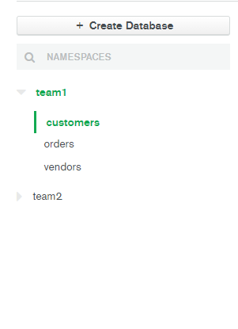

# Hackathon-003
Granular IT Hackathon 2022

## Project Structure
Within this project, there are 3 branches:
* team1
* team2 
* main

Clone the main branch to get started locally with the project.

Inside the project, there are 2 directories:
* api - Where the API is
* ui - Where the user interface is

### API
This is a simple express API. Ideally, this is what you build the most.
To get started, cd into the api directory and run
```bash
npm install && npm start
```

The api has a models directory which contains the Mongoose data models that you will use when interacting with the database.

As in the document, one of the deliverable is to send and fetch data from MongoDB and these data models are a requirement.

In the .env file, you will find the MongoDB uri which is the URI you will use to connect to the database.

#### The Database Structure



* The Database has 2 collections, team1 and team2. You will be interacting with a collection wih respect to which team you are in.

Within the collections, there are 3 tables:
* customers - This is where the customer data exists. There are 8 customers in this table. You are not expected to alter the data, just read(GET) the data and use it appropriately.

* orders - This is where you will store your orders. The table is empty because part of your deliverables is to create orders which you will fetch and display for the vendor.

* vendors - This is just one vendor. Each team has a different vendor with different details, including location which you will use together with the customer location to calculate the distance between them(Use the Google Maps Distance Matrix, you have been provided a GOOGLE MAPS API in the .env file in UI and at the bottom of this Readme file). 

As for the MongoDB URI, you can find it in the .env file in api or at the bottom of this doc.


### UI
This is a simple react app set up with create-react-app. 

It has been styled with TailwindCSS and Styled-components (technically, you are not expected to alter the UI, but it is okay if you have the time.)

To get started, cd into ui and run:
```bash
npm install && npm start
```

Inside the pages, there are 2 files, 
* customer.js - The customer page
* vendor.js - The vendor page

On the hosted site, the customer page is the main path("/") or "/customer" while the vendor page is the path "/vendor"

Basically, you are supposed to build the API to perform the required tasks as per the document, then on the UI, consume the API.

NOTE: On the Customer page, there is a select box which you should use to toggle between the 8 customers. When a certain customer is selected, that customer's details should be automatically filled in the form.
Ideally, you are expected to fetch all the customer details and use them on that select box.


### Collaborating (Very Important)

Ensure you continously push your code to Github to your respective branch. 

These branches have been set up to automatically deploy changes, that way, we are able to track your progress. 

The Links to the hosted branches are in the 'Important Links' section of this documentation.

### Important Links
* MongoDB URI: 

         For TEAM 1 - [DELETED]
         For TEAM 2 - [DELETED]

* GOOGLE MAPS API:

         [DELETED]

* The Hosted Links:

    Team 1:

        API - https://team1-api-hackathon-2022.onrender.com
        UI - https://team1-hackathon-2022.netlify.app

    Team 2:

        API - https://team2-api-hackathon-2022.onrender.com
        UI - https://team2-hackathon-2022.netlify.app


### HAPPY HACKING!!


